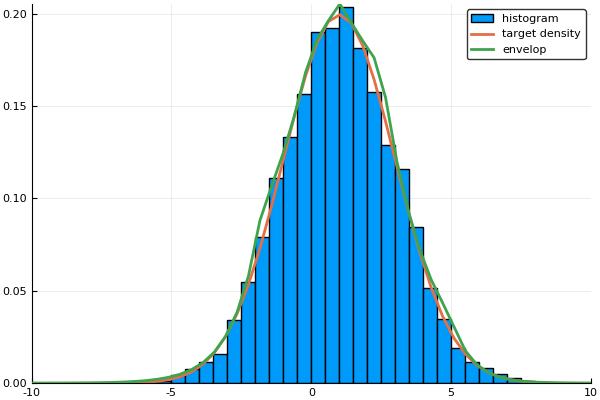
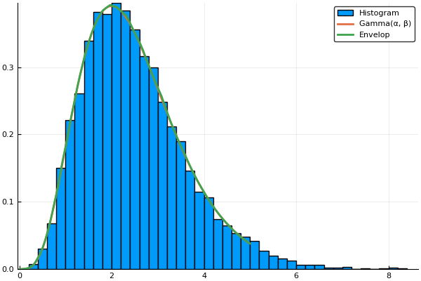
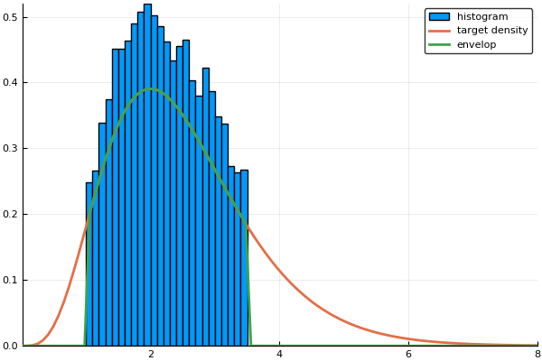
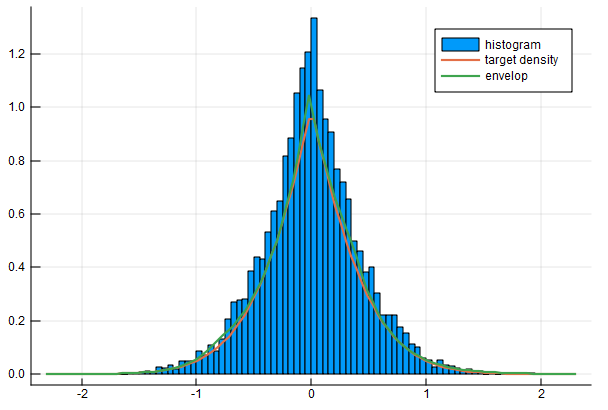

[](https://travis-ci.org/mauriciogtec/AdaptiveRejectionSampling.jl)
[](https://coveralls.io/github/mauriciogtec/AdaptiveRejectionSampling.jl?branch=master)
[](https://codecov.io/gh/mauriciogtec/AdaptiveRejectionSampling.jl)

[](https://opensource.org/licenses/mit-license.php)

# AdaptiveRejectionSampling


```julia
using AdaptiveRejectionSampling
using Plots
```

## Sampling from a shifted normal distribution


```julia
# Define function to be sampled
μ, σ = 1.0, 2.0
f(x) = exp(-0.5(x - μ)^2 / σ^2) / sqrt(2pi * σ^2) 
support = (-Inf, Inf)

# Build the sampler and simulate 10,000 samples
sampler = RejectionSampler(f, support, max_segments = 5)
@time sim = run_sampler!(sampler, 10000);
```

      0.010434 seconds (192.15 k allocations: 3.173 MiB)
    

Let's verify the result


```julia
# Plot the results and compare to target distribution
x = range(-10.0, 10.0, length=100)
envelop = [eval_envelop(sampler.envelop, xi) for xi in x]
target = [f(xi) for xi in x]

histogram(sim, normalize = true, label = "Histogram")
plot!(x, [target envelop], width = 2, label = ["Normal(μ, σ)" "Envelop"])
```





## Let's try a Gamma


```julia
α, β = 5.0, 2.0
f(x) = β^α * x^(α-1) * exp(-β*x) / gamma(α)
support = (0.0, Inf)

# Build the sampler and simulate 10,000 samples
sampler = RejectionSampler(f, support)
@time sim = run_sampler!(sampler, 10000) 

# Plot the results and compare to target distribution
x = range(0.0, 5.0, length=100)
envelop = [eval_envelop(sampler.envelop, xi) for xi in x]
target = [f(xi) for xi in x]

histogram(sim, normalize = true, label = "Histogram")
plot!(x, [target envelop], width = 2, label = ["Gamma(α, β)" "Envelop"])
```

      0.007299 seconds (182.00 k allocations: 3.027 MiB)
    




## Truncated distributions and unknown normalisation constant

We don't to provide an exact density--it will sample up to proportionality--and we can do truncated distributions


```julia
α, β = 5.0, 2.0
f(x) = β^α * x^(α-1) * exp(-β*x) / gamma(α)
support = (1.0, 3.5)

# Build the sampler and simulate 10,000 samples
sampler = RejectionSampler(f, support)
@time sim = run_sampler!(sampler, 10000) 

# Plot the results and compare to target distribution
x = range(0.01, 8.0, length=100)
envelop = [eval_envelop(sampler.envelop, xi) for xi in x]
target = [f(xi) for xi in x]

histogram(sim, normalize = true, label = "histogram")
plot!(x, [target envelop], width = 2, label = ["target density" "envelop"])
```

      0.007766 seconds (181.82 k allocations: 3.024 MiB)
    



## Elastic Net distribution

The following example arises from elastic net regression and smoothing problems. In these cases, the integration constants are not available analytically.

```julia
# Define function to be sampled
function f(x, μ, λ1, λ2)
      δ = x - μ
      nl = λ1 * abs(δ) + λ2 * δ^2
      return exp(-nl)
end
support = (-Inf, Inf)

# Build the sampler and simulate 10,000 samples
μ, λ1, λ2 = 0.0, 2.0, 1.0
sampler = RejectionSampler(x -> f(x, μ, λ1, λ2), support, max_segments = 5)
@time sim = run_sampler!(sampler, 10000);

# Plot the results and compare to target distribution
x = range(-2.3, 2.3, length=100)
envelop = [eval_envelop(sampler.envelop, xi) for xi in x]
target = [f(xi, μ, λ1, λ2) for xi in x]

histogram(sim, normalize = true, label = "histogram")
plot!(x, [target envelop], width = 2, label = ["target density" "envelop"])
```


