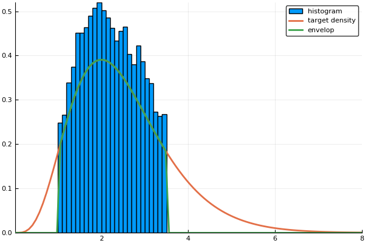
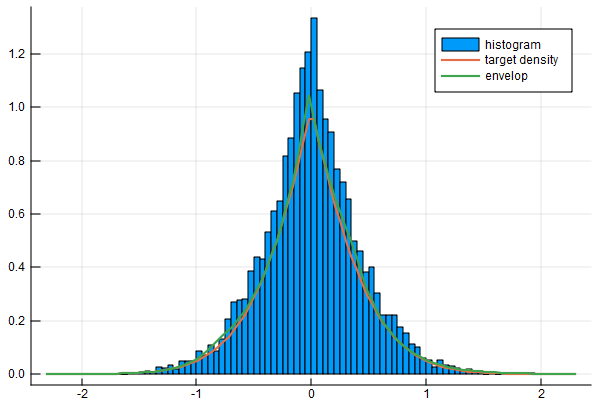
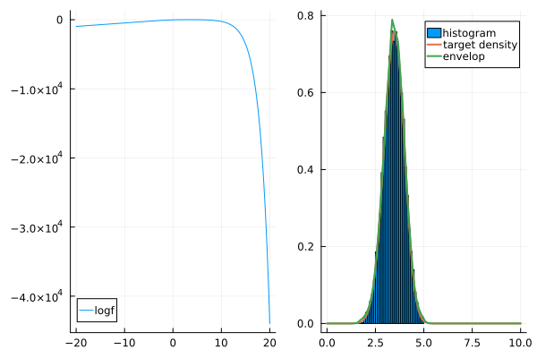

[](https://travis-ci.org/mauriciogtec/AdaptiveRejectionSampling.jl)
[](https://coveralls.io/github/mauriciogtec/AdaptiveRejectionSampling.jl?branch=master)
[](https://codecov.io/gh/mauriciogtec/AdaptiveRejectionSampling.jl)

[](https://opensource.org/licenses/mit-license.php)

# AdaptiveRejectionSampling

This package is useful for efficient sampling from log-concave univariate density functions.


## Examples

```julia
using AdaptiveRejectionSampling: Objective, ARSampler, sample!, eval_hull, abscissae
using SpecialFunctions: gamma
using CairoMakie
```

### Sampling from a shifted normal distribution


```julia
const μ, σ = 1.0, 2.0

function bench()
    # Define function to be sampled
    f(x) = log(exp(-0.5(x - μ)^2 / σ^2) / sqrt(2pi * σ^2)) 
    support = (-10., 10.)
    
    # Build the sampler and simulate 10,000 samples
    obj = Objective(f)
    sampler = ARSampler(obj, support)
    b = @be deepcopy(sampler) sample!(_, 10000, true, 10);
return sampler, b
end
s, b = bench();
b
```

      Benchmark: 126 samples with 1 evaluation
      min    616.951 μs (17 allocs: 80.523 KiB)
      median 641.532 μs (17 allocs: 80.523 KiB)
      mean   749.812 μs (17.10 allocs: 80.625 KiB, 0.75% gc time)
      max    13.744 ms (20 allocs: 83.711 KiB, 94.06% gc time)

Let's verify the result


```julia
# Plot the results and compare to target distribution
f(x) = log(exp(-0.5(x - μ)^2 / σ^2) / sqrt(2pi * σ^2)) 
x = range(-10.0, 10.0, length=100)
envelop = eval_hull.(s.upper_hull, x)
target = f.(x)
samples = sample!(s, 10000, max_segments = 5)

fig, ax, p = hist(samples, bins=25, normalization = :pdf, label = "Samples");
lines!(ax, -10..10, x -> exp(f(x)), label = "Target", color = :orange)
lines!(ax, x, exp.(envelop), label = "Envelop", color = :black, alpha = 0.8)
absc = ARS.abscissae(s.upper_hull)
scatter!(ax, absc, exp.(eval_hull.(s.upper_hull, absc)), label = "Abscissae", color = :red)
axislegend(ax)
fig
# histogram(sim, normalize = true, label = "Histogram")
# plot!(x, [target envelop], width = 2, label = ["Normal(μ, σ)" "Envelop"])
```


### Let's try a Gamma


```julia
α, β = 5.0, 2.0
f(x) = β^α * x^(α-1) * exp(-β*x) / gamma(α)
support = (0.0, Inf)

obj = Objective(x -> log(f(x)))
sam = ARSampler(obj, support)
@time sim = sample!(sam, 10000, max_segments = 5)

# Verify result
x = range(0.0, 8.0, length=100)
envelop = eval_hull.(sam.upper_hull, x)
target = f.(x)
mx = maximum(sim)
fig, ax, p = hist(sim, bins=50, normalization = :pdf, label = "Samples");
lines!(ax, 0..mx, y -> f(y), label = "Target", color = :orange)
lines!(ax, 0..mx, y -> exp(eval_hull(sam.upper_hull, y)), label = "Envelop", color = :black, alpha = 0.8)
absc = abscissae(sam.upper_hull)
scatter!(ax, absc, exp.(eval_hull.(sam.upper_hull, absc)), label = "Abscissae", color = :red)
axislegend(ax)
fig
```

      0.000772 seconds (100 allocations: 85.211 KiB)


### Truncated distributions and unknown normalization constant

We don't to provide an exact density--it will sample up to proportionality--and we can do truncated distributions


```julia
α, β = 5.0, 2.0
f(x) = β^α * x^(α-1) * exp(-β*x) / gamma(α)
support = (1.0, 3.5)

# Build the sampler and simulate 10,000 samples
sampler = RejectionSampler(f, support)
@time sim = run_sampler!(sampler, 10000) 

# Plot the results and compare to target distribution
x = range(0.01, 8.0, length=100)
envelop = [eval_envelop(sampler.envelop, xi) for xi in x]
target = [f(xi) for xi in x]

histogram(sim, normalize = true, label = "histogram")
plot!(x, [target envelop], width = 2, label = ["target density" "envelop"])
```

      0.007766 seconds (181.82 k allocations: 3.024 MiB)
    



### Elastic Net Distribution

The following example arises from elastic net regression and smoothing problems. In these cases, the integration constants are not available analytically.

```julia
# Define function to be sampled
function f(x, μ, λ1, λ2)
      δ = x - μ
      nl = λ1 * abs(δ) + λ2 * δ^2
      return exp(-nl)
end
support = (-Inf, Inf)

# Build the sampler and simulate 10,000 samples
μ, λ1, λ2 = 0.0, 2.0, 1.0
sampler = RejectionSampler(x -> f(x, μ, λ1, λ2), support, max_segments = 5)
@time sim = run_sampler!(sampler, 10000);

# Plot the results and compare to target distribution
x = range(-2.3, 2.3, length=100)
envelop = [eval_envelop(sampler.envelop, xi) for xi in x]
target = [f(xi, μ, λ1, λ2) for xi in x]

histogram(sim, normalize = true, label = "histogram")
plot!(x, [target envelop], width = 2, label = ["target density" "envelop"])
```



### Tips for numerical stability, use of logdensity

Here are some tips:

- Make sure the logdensity is numerically stable in the domain and avoid logdensity values > 25 (since
  the evaluation of the envelop requires exponentials);
- Use log densities instead of densities using the keyword `logdensity=true`;
- Specify a `min_slope` and `max_slope` to find better initial points. The default is 1e-6 and 1e6, respectively.
  The `min_slope` is the minimum slope of the logdensity in the initial points  of the envelop in absolute value. In general,
  it is a good idea to leave `min_slope` with the default and try `max_slope=10.0` or a smaller number.
- Try setting `δ` to a smaller value in the search_grid. The default is 0.5. 


⚠️ *Warning* ⚠️: Using `logdensity=true` will be the default in v1.0.

Here is an example

```julia
import StatsFuns: logsumexp
n = 50
k = 10
alpha = 0.5
tau = 0.5
theta = 1.0

# a complicated logdensity
logf(v) = n * v - (n - k * alpha) * logsumexp([v, log(tau)]) - theta / alpha * ( (tau + exp(v) )^alpha )

# run sampler
δ = 0.1
support = (-Inf, Inf)
search = (0.0, 10.0)
sampler = RejectionSampler(logf, support, δ, max_segments=10, logdensity=true, search_range=search, max_slope=10.0)
@time sim = run_sampler!(sampler, 10000)
```

```
[ Info: initial points found at 1.08, 5.43 with grads 9.94522619043481, -9.98968199019509
      0.016296 seconds (371.21 k allocations: 6.850 MiB)
```


```julia
x = range(0, 10, length=200)
normconst = sum(f.(x)) * (x[2] - x[1])
envelop = [eval_envelop(sampler.envelop, xi) for xi in x] ./ normconst
target = [f(xi) for xi in x] ./ normconst

# make two plots of logf and f
p1 = plot(logf, -20, 20, label = "logf")
p2 = histogram(sim, normalize=true, label="histogram")
plot!(p2, x, [target envelop], width=2, label=["target density" "envelop"])

plot(p1, p2, layout = (1, 2))
```



## Citation


```bibtex
@manual{tec2018ars,
  title = {AdaptiveRejectionSampling.jl},
  author = {Mauricio Tec},
  year = {2018},
  url = {https://github.com/mauriciogtec/AdaptiveRejectionSampling.jl}
}
```
