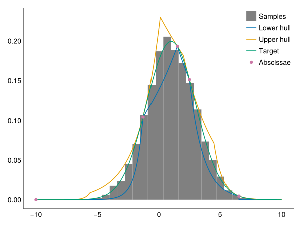
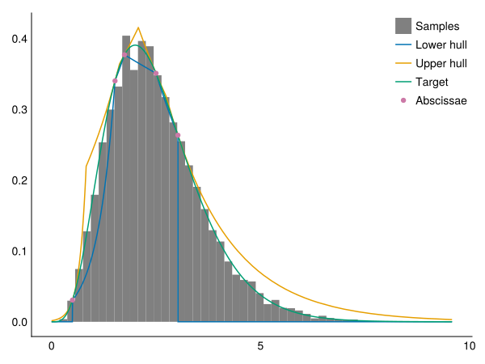
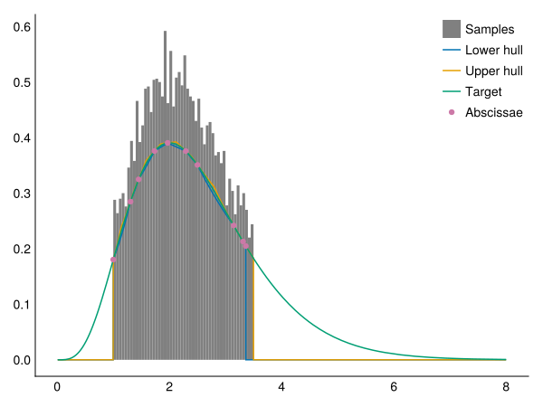
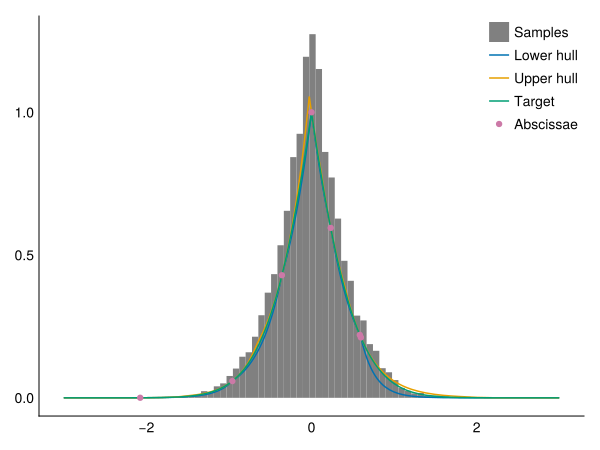
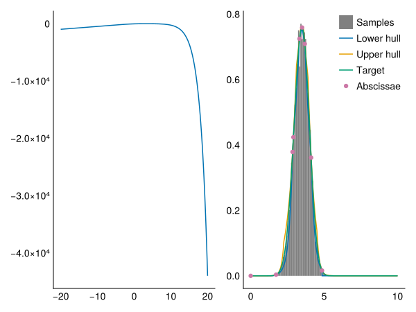

[](https://travis-ci.org/mauriciogtec/AdaptiveRejectionSampling.jl)
[](https://coveralls.io/github/mauriciogtec/AdaptiveRejectionSampling.jl?branch=master)
[](https://codecov.io/gh/mauriciogtec/AdaptiveRejectionSampling.jl)

[](https://opensource.org/licenses/mit-license.php)

# AdaptiveRejectionSampling

This package is useful for efficient sampling from log-concave univariate density functions.


## Examples

```julia
# Import packages and setup
using AdaptiveRejectionSampling: Objective, ARSampler, sample!, eval_hull, abscissae, hullplot!
using SpecialFunctions: gamma
using CairoMakie
using Chairmarks

set_theme!(theme_minimal())
```

### Sampling from a shifted normal distribution


```julia
const μ, σ = 1.0, 2.0

function bench()
    # Define function to be sampled
    f(x) = log(exp(-0.5(x - μ)^2 / σ^2) / sqrt(2pi * σ^2)) 
    support = (-10., 10.)
    
    # Build the sampler and simulate 10,000 samples
    obj = Objective(f)
    sampler = ARSampler(obj, support)
    b = @be deepcopy(sampler) sample!(_, 10000, max_segments = 10);
return sampler, b
end
s, b = bench();
b
```

    Benchmark: 166 samples with 1 evaluation
     min    535.050 μs (3 allocs: 78.195 KiB)
     median 565.130 μs (6 allocs: 81.852 KiB)
     mean   571.223 μs (5.73 allocs: 81.521 KiB)
     max    740.072 μs (6 allocs: 81.852 KiB)

Let's verify the result


```julia
# Plot the results and compare to target distribution
f(x) = log(exp(-0.5(x - μ)^2 / σ^2) / sqrt(2pi * σ^2)) 
x = range(-10.0, 10.0, length=100)
envelop = eval_hull.(s.upper_hull, x)
target = f.(x)
samples = sample!(s, 10000, max_segments = 5)

fig, ax, p = hist(samples, bins=25, color = :grey, normalization = :pdf, label = "Samples");
hullplot!(ax, -10..10, s, target = true)
axislegend(ax)
fig
```





### Let's try a Gamma


```julia
α, β = 5.0, 2.0
f(x) = β^α * x^(α-1) * exp(-β*x) / gamma(α)
support = (0.0, Inf)

obj = Objective(x -> log(f(x)))
sam = ARSampler(obj, support)
sim = sample!(sam, 10000, max_segments = 5)

# Verify result
mx = maximum(sim)
fig, ax, p = hist(sim, bins=50, color = :grey, normalization = :pdf, label = "Samples");
hullplot!(ax, 0..mx, sam, target = true)
axislegend(ax)
fig
```



### Truncated distributions and unknown normalization constant

We don't to provide an exact density--it will sample up to proportionality--and we can do truncated distributions


```julia
α, β = 5.0, 2.0
f(x) = β^α * x^(α-1) * exp(-β*x) / gamma(α)
support = (1.0, 3.5)

obj = Objective(x -> log(f(x)))
sam = ARSampler(obj, support)
sim = sample!(sam, 10000, max_segments = 10)

# Plot the results and compare to target distribution
fig, ax, p = hist(sim, bins=50, color = :grey, normalization = :pdf, label = "Samples");
hullplot!(ax, 0.01..8.0, sam, target = true)
axislegend(ax)
fig
```



### Elastic Net Distribution

The following example arises from elastic net regression and smoothing problems. In these cases, the integration constants are not available analytically.

```julia
# Define function to be sampled
function f(x, μ, λ1, λ2)
      δ = x - μ
      nl = λ1 * abs(δ) + λ2 * δ^2
      return exp(-nl)
end

support = (-Inf, Inf)
mu, L1, L2 = 0.0, 2.0, 1.0
obj = Objective(x -> log(f(x, mu, L1, L2)))
sam = ARSampler(obj, support)
sim = sample!(sam, 10000, max_segments = 10)

fig, ax, p = hist(sim, bins=50, color = :grey, normalization = :pdf, label = "Samples");
hullplot!(ax, -3..3, sam, target = true)
axislegend(ax)
fig
```



#### Example of more complicated density

```julia
import StatsFuns: logsumexp
n = 50
k = 10
alpha = 0.5
tau = 0.5
theta = 1.0

# a complicated logdensity
logf(v) = n * v - (n - k * alpha) * logsumexp([v, log(tau)]) - theta / alpha * ( (tau + exp(v) )^alpha )
f(x) = exp(logf(x))

# run sampler
δ = 0.1
support = (-Inf, Inf)
search = (0.0, 10.0)
obj = Objective(logf)
sam = ARSampler(obj, support, search)
sim = sample!(sam, 10000, max_segments = 10)

x = range(0, 10, length=200)
normconst = sum(f.(x)) * (x[2] - x[1])

fig, ax, p = lines(-20..20, logf);
ax2 = Axis(fig[1,2])
hist!(ax2, sim, bins=50, color = :grey, normalization = :pdf, label = "Samples")
hullplot!(ax2, 0..10, sam, target = true, normconst = 1 / normconst)
axislegend(ax2)
fig

sampler = RejectionSampler(logf, support, δ, max_segments=10, logdensity=true, search_range=search, max_slope=10.0)
@time sim = run_sampler!(sampler, 10000)
```


```julia
x = range(0, 10, length=200)
normconst = sum(f.(x)) * (x[2] - x[1])
envelop = [eval_envelop(sampler.envelop, xi) for xi in x] ./ normconst
target = [f(xi) for xi in x] ./ normconst

# make two plots of logf and f
p1 = plot(logf, -20, 20, label = "logf")
p2 = histogram(sim, normalize=true, label="histogram")
plot!(p2, x, [target envelop], width=2, label=["target density" "envelop"])

plot(p1, p2, layout = (1, 2))
```



## Citation


```bibtex
@manual{tec2018ars,
  title = {AdaptiveRejectionSampling.jl},
  author = {Mauricio Tec, Elias Sjölin},
  year = {2018},
  url = {https://github.com/mauriciogtec/AdaptiveRejectionSampling.jl}
}
```
